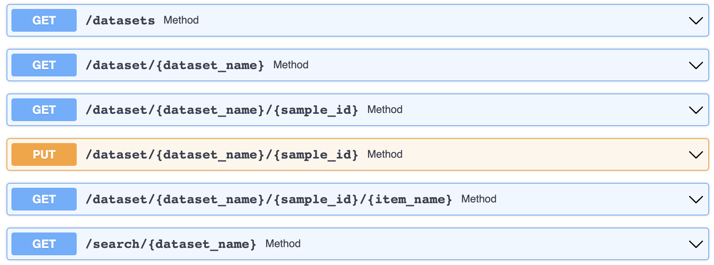

# The UnderfolderAPI Server Example

## Requirements

```
pip install uvicorn
pip install webbrowser
```


This example launches the UnderfolderAPI server over a target Underfolder. The API exposes the following endpoints:



To launche the server, run the following command:

```
python underfolder_api_server.py 
```

The server will target the test Minimnist underfolder. To launch the server on custom underfolder, use the following command:

```
python underfolder_api_server.py -i $UNDERFOLDER_PATH
```

The script will also open a browser to the **index.html** page provided statically by the same server. This page contains some HTML/CSS/JS sample code to interact with the APIs.
